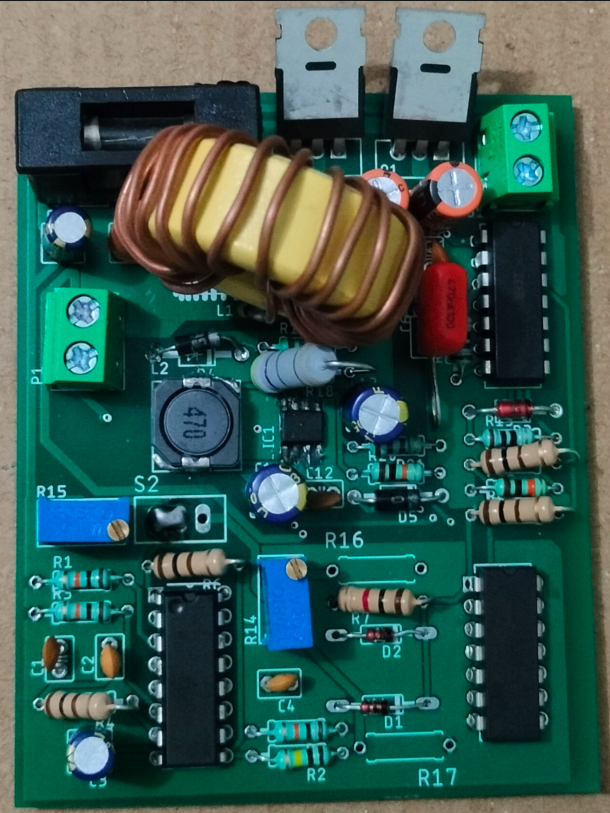
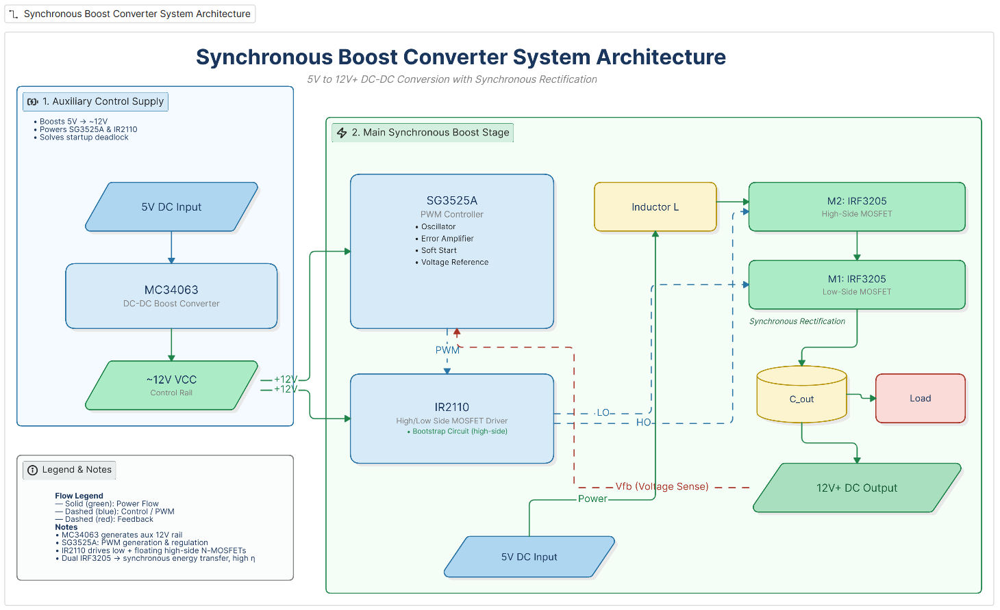
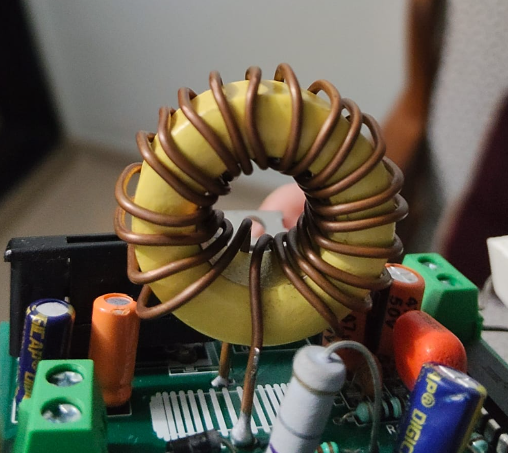

# 5V to 10–20V, 20W Synchronous Boost Converter

A fully designed and built **synchronous boost converter** that steps up a 5V input to an adjustable 10–20V output at up to 20W. The design implements both **open-loop** and **closed-loop** control modes on a single hardware platform, with a dedicated MC34063-based auxiliary supply that solves the classic 5V bootstrap deadlock.



---

## Features

- **Input:** 5V (USB or regulated supply, ≥5A source recommended)
- **Output:** Adjustable 10V–20V, up to 20W (1A at 20V)
- **Synchronous rectification** using dual N-channel MOSFETs (IRF3205)
- **PWM control** via SG3525A with open-loop and closed-loop modes selectable via switch
- **High-side + low-side gate drive** using IR2110 with bootstrap circuit
- **Auxiliary 12V control supply** generated from 5V input using MC34063 — eliminates startup deadlock
- **Hand-wound toroidal inductor** (33 µH, 19 turns) with energy-based core selection

---

## System Architecture

The design is split into two functional blocks:

**1. Auxiliary Control Supply (MC34063)**
Boosts 5V → ~12V to power the SG3525A and IR2110. This solves the startup deadlock — the SG3525A requires >5V to operate and cannot self-start from the 5V input rail alone.

**2. Main Synchronous Boost Stage (SG3525A + IR2110 + IRF3205)**
- SG3525A generates PWM and provides oscillator, error amplifier, soft-start, and reference
- IR2110 drives both low-side (M1) and floating high-side (M2) N-channel MOSFETs via bootstrap
- Two IRF3205 MOSFETs perform synchronous energy transfer from inductor to output


---

## Key Design Parameters

| Parameter | Value |
|---|---|
| Input Voltage | 5V |
| Output Voltage | 10V – 20V (adjustable) |
| Max Output Power | 20W |
| Max Output Current | 1A (at 20V) |
| Max Input Current | ~4.7A (at 85% efficiency) |
| Max Duty Cycle | 75% (at Vout = 20V) |
| Switching Frequency | 100 kHz |
| Peak Inductor Current | ~5.3A |

---

## Design Calculations

### Duty Cycle

At maximum output (20V):

$$D = 1 - \frac{V_{in}}{V_{out}} = 1 - \frac{5}{20} = 0.75$$

### Input Current (at 85% efficiency)

$$I_{in} = \frac{P_{out}}{\eta \cdot V_{in}} = \frac{20}{0.85 \times 5} \approx 4.7\text{ A}$$

### Inductor Value (25% ripple target)

$$\Delta I_L = 0.25 \times 4.7 = 1.18\text{ A}$$

$$L = \frac{V_{in} \cdot D}{f_{sw} \cdot \Delta I_L} = \frac{5 \times 0.75}{100000 \times 1.18} \approx 31.8\text{ µH} \rightarrow \textbf{33 µH}$$

### Peak Inductor Current

$$I_{peak} = I_{in} + \frac{\Delta I_L}{2} = 4.7 + \frac{1.18}{2} \approx 5.3\text{ A}$$

Inductor saturation rating chosen: **≥ 6A**

### Output Capacitor

$$C_{out} = \frac{I_{out} \cdot D}{f_{sw} \cdot \Delta V_{out}} = \frac{1 \times 0.75}{100000 \times 0.2} = 37.5\text{ µF} \rightarrow \textbf{2 × 47 µF (parallel)}$$

---

## Auxiliary Supply — MC34063 Design (5V → 12V)

The MC34063 auxiliary stage is independently designed and verified using the official ON Semiconductor datasheet equations.

### Design Parameters

| Parameter | Value |
|---|---|
| Input | 5V |
| Output | ~12V |
| Inductor | 47µH (CDRH104R, ferrite, 1.9A rated, DCR = 128mΩ) |
| Diode | 1N5819 Schottky |
| Rsc | 2× 0.47Ω in parallel = 0.235Ω |
| Peak Switch Current (Ipk) | 1.277A |
| Switching Frequency | ~43 kHz |
| Max Output Current | ~224mA |

### MC34063 Auxiliary Supply Calculations

**ton/toff ratio** (from voltage conversion ratio):

$$\frac{t_{on}}{t_{off}} = \frac{V_{out} + V_f - V_{in}}{V_{in} - V_{sat}} = \frac{12 + 0.4 - 5}{5 - 1} = 1.85$$

**Peak current** (set by Rsc):

$$I_{pk} = \frac{0.3}{R_{sc}} = \frac{0.3}{0.235} = 1.277\text{ A}$$

**ON-time** (from inductor current ramp):

$$t_{on} = \frac{I_{pk} \times L}{V_{in} - V_{sat}} = \frac{1.277 \times 47 \times 10^{-6}}{4} = 15.0\text{ µs}$$

**Timing capacitor** (datasheet equation):

$$C_t = 4.0 \times 10^{-5} \times t_{on} = 4.0 \times 10^{-5} \times 15.0 \times 10^{-6} = 600\text{ pF} \rightarrow \textbf{680 pF (standard)}$$

**Output voltage** (feedback divider):

$$V_{out} = 1.25 \times \left(1 + \frac{R_2}{R_1}\right) = 1.25 \times \left(1 + \frac{19000}{2200}\right) = 12.0\text{ V}$$

### MC34063 Component List

| Component | Value | Notes |
|---|---|---|
| IC | MC34063A | DIP-8 |
| L1 | 47µH — CDRH104R | Ferrite, 1.9A rated, DCR = 128mΩ |
| D1 | 1N5819 | Schottky rectifier |
| Rsc | 2× 0.47Ω in parallel | 0.235Ω effective |
| Ct | 680pF ceramic | Sets fsw ≈ 43kHz |
| Cin | 100µF / 10V | Electrolytic, close to Pin 6 |
| Cout | 100µF / 25V | Electrolytic, across 12V output |
| R1 | 2.2kΩ | Pin 5 to GND |
| R2 | 18kΩ + 1kΩ in series (= 19kΩ) | Vout to Pin 5 |
| R4 | 100Ω | Pin 8 to Vin — do not omit |

---

## Toroidal Core Inductor — Design & Winding

### Core Selection via Energy Method

$$E = \frac{1}{2} L I_{peak}^2 = \frac{1}{2} \times 33 \times 10^{-6} \times (5.3)^2 \approx 463\text{ µJ}$$

The core's energy handling capability was verified to exceed this value with adequate margin before finalising the core.

### Turn Count

$$N = \sqrt{\frac{L}{A_L}}$$

For the selected core with AL ≈ 135 nH/turn²:

$$N = \sqrt{\frac{33 \times 10^{-6}}{135 \times 10^{-9}}} \approx 15.6 \rightarrow \textbf{19 turns (with margin)}$$

19 turns were wound to ensure the inductance target is met with headroom, accounting for winding geometry and practical AL variation.

**Wire:** AWG 16 magnet wire — rated for RMS inductor current with acceptable temperature rise.



---

## Component Selection

### Main Power Stage

| Component | Value / Part | Reason |
|---|---|---|
| M1, M2 | IRF3205 | Low Rds(on), high current for 5V-input high-current design |
| PWM IC | SG3525A | Built-in oscillator, error amplifier, soft-start, and shutdown |
| Gate Driver | IR2110 | Floating high-side + low-side N-channel MOSFET drive |
| Main Inductor | 33µH, 26T toroid, ≥6A sat | Meets ripple and peak current requirement |
| Output Capacitor | 2× 47µF / 35V low-ESR | Ripple reduction and output energy storage |
| Input Capacitor | 100µF / 10V + 10µF ceramic | Reduces input droop and HF noise |
| Bootstrap Capacitor | 100nF / 50V | Required by IR2110 high-side drive |
| Bootstrap Diode | UF4007 | Fast recovery diode for bootstrap charging path |
| Gate Resistors | 10Ω | Current limiting and ringing suppression |

### Auxiliary Supply (MC34063)

| Component | Value / Part | Reason |
|---|---|---|
| IC | MC34063A | Step-up regulator, operates directly from 5V |
| Inductor | 47µH — CDRH104R | Ferrite core, low DCR (128mΩ), 1.9A rated |
| Diode | 1N5819 | Low forward-drop Schottky rectifier |
| Rsc | 2× 0.47Ω in parallel | Sets Ipk = 1.277A; within 1.5A IC limit |
| Timing Capacitor | 680pF | Sets fsw ≈ 43kHz per datasheet equation |
| Output Capacitor | 100µF / 25V | Stabilises 12V control rail |
| R1 | 2.2kΩ | Bottom of feedback divider |
| R2 | 18kΩ + 1kΩ in series | Sets output to exactly 12.0V |
| R4 (driver) | 100Ω | Base current limiting for Pin 8 internal driver |

---

## Control Modes

A mode-select switch routes either signal to the SG3525A control input:

**Open-loop mode:** VR2 potentiometer divides the SG3525A's internal 5.1V reference to produce a manually adjustable duty cycle. Output voltage varies without automatic correction.

**Closed-loop mode:** VR1 potentiometer sets the regulation setpoint. The output is divided down and compared with the 5.1V reference through the SG3525A error amplifier. Duty cycle automatically adjusts to maintain the set output voltage.

---

## Schematics

| File | Description |
|---|---|
| `schematic and PCB layout/full_schematic.pdf` | Complete circuit schematic |
| `schematic and PCB layout/auxiliary_supply_mc34063.png` | MC34063 5V → 12V auxiliary stage |
| `schematic and PCB layout/main_boost_stage.png` | SG3525A + IR2110 + IRF3205 power stage |

---

## Testing Procedure

### Phase 1 — Visual Check (Before Power-On)

- Verify IC orientation — Pin 1 dot matches schematic
- Check 1N5819 polarity — stripe (cathode) faces Vout
- Check electrolytic capacitor polarity (Cin and Cout)
- Confirm both 0.47Ω Rsc resistors soldered in parallel between Pin 7 and Pin 6
- Measure Rsc with multimeter → should read ~0.23–0.25Ω

### Phase 2 — Auxiliary Supply First

1. Apply 5V to input with no main stage load
2. Measure MC34063 output → should read **11.8–12.2V**
3. Probe Pin 3 (Ct) with oscilloscope → ~43kHz sawtooth

### Phase 3 — Main Stage Bring-Up (Current-Limited Supply)

1. Set bench supply current limit to **1A initially**
2. Open-loop mode, start at minimum duty (VR2 fully wound down)
3. Gradually increase duty — monitor switch node for ringing
4. Verify IR2110 HO/LO gate signals and confirm dead time is present
5. Increase load progressively to full 20W

### Phase 4 — Full Load Verification

| Measurement | Expected Value |
|---|---|
| Vout (no load) | 10–20V adjustable |
| Vout (full load, 20W) | Stable within ±5% |
| Input current at 20W | ~4.7A |
| Output ripple | < 200mV peak-to-peak |
| Efficiency | 75–85% |
| MOSFET temperature at 20W | < 60°C (add heatsink if higher) |

---

## Test Results

See [`results/measurements.md`](results/measurements.md) for full tabulated results.

> **Note:** Results will be populated after hardware bring-up is complete.


---

## Build Notes and Cautions

- **Switch node layout is critical.** Keep M1 drain, M2 source, inductor connection, and IR2110 VS pin in a tight loop. Excessive PCB area causes ringing and EMI.
- **Always bring up the MC34063 auxiliary rail first.** Confirm ~12V on the control rail before enabling the main switching stage.
- **Use a current-limited bench supply** for initial main stage testing. Start at reduced duty in open-loop before enabling closed-loop.
- **Verify inductor saturation margin.** At 5.3A peak, use an inductor rated ≥6A. Saturation causes uncontrolled current spikes that can destroy the MOSFETs instantly.
- **Check thermal rise at 20W.** Conduction and switching losses at 4.7A input current are significant. Heatsinking of IRF3205 may be required.
- **Do not omit R4 (100Ω) on MC34063 Pin 8.** Without it, the internal driver transistor cannot be properly biased at 5V Vin.

---

## Known Limitations

- No dedicated overcurrent protection on the main boost stage — rely on bench supply current limiting during testing
- Soft-start provided by SG3525A but not independently tuned; may need adjustment for different load profiles
- Closed-loop compensation network not fully optimised — transient response may show overshoot under step-load changes

---

## Repo Structure

```
Boost-converter-5v-20v/
├── README.md
├── docs/
│   ├── design_report.pdf
│   ├── calculations.md
│   └── energy_core_selection.md
├── schematic and PCB layout/
│   ├── full_schematic.pdf
│   ├── auxiliary_supply_mc34063.png
│   └── main_boost_stage.png
├── DesignFiles/
│   ├── BOM
│   ├── EAGLECAD Project file
│   ├── EAGLECAD schematic file
│   ├── EAGLECAD BRD file
│   ├── Gerber files
│   └── Drill fies
├── Images/
│   ├── board_top.jpg
│   ├── board_bottom.jpg
│   ├── inductor_wound.jpg
│   ├── test_setup.jpg
│   ├── waveform_gate_drive.jpg
│   ├── waveform_switch_node.jpg
│   └── output_voltage_regulation.jpg
└── results/
    └── measurements.md
```

---

## References

- SG3525A Datasheet — Texas Instruments
- IR2110 Datasheet — Infineon (formerly International Rectifier)
- IRF3205 Datasheet — Infineon
- MC34063A Datasheet — ON Semiconductor / onsemi
- Mohan, Undeland & Robbins — *Power Electronics: Converters, Applications, and Design*

---